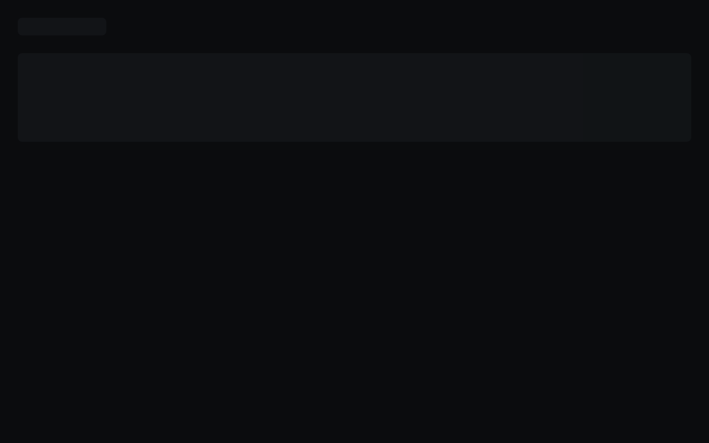
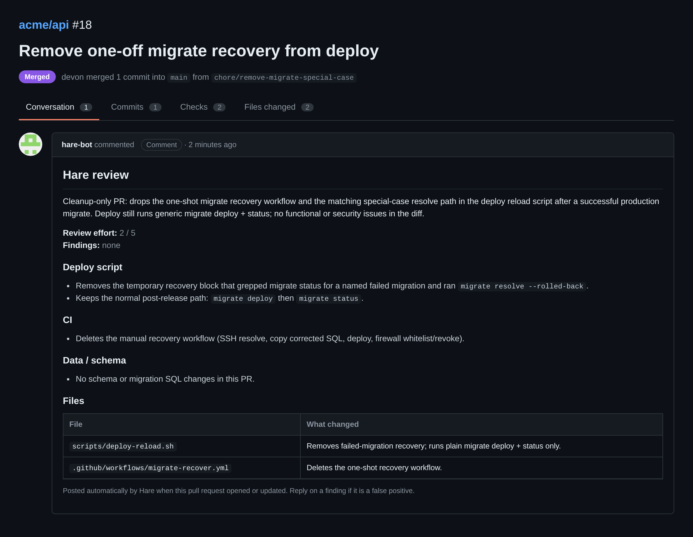
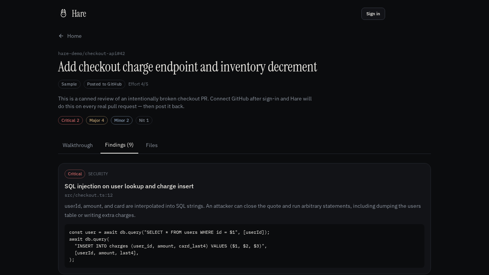

# Hare

**Hare** is an automated GitHub pull-request reviewer. It watches repositories you connect, reviews every new or updated PR with an LLM, posts inline comments as a dedicated bot account, and can set a commit status named `Hare` so merge can be blocked on critical/major findings.

Built and maintained by [**ginxx009**](https://github.com/ginxx009).

[](LICENSE)

---

## What it looks like

Inbox of watched pull requests — status, findings, and re-review in one place:



What **hare-bot** posts on GitHub (sample, names and paths changed):



A finished review in Hare — walkthrough plus Critical / Major / Minor / Nit findings:



---

## What it does

Hare is a CodeRabbit-style reviewer you host yourself:

1. You connect a **fine-grained GitHub PAT** for a bot user (for example `hare-bot`).
2. You **watch** repositories.
3. On every PR **opened**, **synchronized** (new commits), **reopened**, or **ready for review**, Hare:
   - Loads the unified diff
   - Pulls sibling context (auth helpers, Prisma schema, local imports)
   - Reviews with Grok
   - Posts a walkthrough + inline findings as the bot user
   - Sets the **`Hare`** commit status (`success` or `failure`)

Webhooks return immediately and reviews run on a queue (up to 4 PRs in parallel). Sync reviews every open PR on watched repos, not a cap of 3.

Findings are graded:

| Severity | Meaning | Merge gate |
| --- | --- | --- |
| **Critical** | Demonstrated exploit, secret leak, auth bypass, data loss | **Blocks** (`Hare` = failure) |
| **Major** | Definite bug or broken contract you can prove from the diff + repo context | **Blocks** |
| **Minor** | Validation, error UI, tests, product risk without a proven exploit | Passes |
| **Nit** | Naming, enums, comments | Passes |

Accuracy rules the reviewer follows:

- Prefer fewer, sharper findings over a laundry list.
- Do not file Critical/Major on a pattern the rest of the repo already uses.
- Hypotheticals (`only if`, `confirm that`) are demoted.
- Prisma/SQL foreign keys must match the referenced column type (for example `UUID` vs `TEXT`).
- Every finding must sit on a real changed line.

---

## Screens

| Area | Purpose |
| --- | --- |
| **Inbox** | Open PRs from watched repos. Sync pulls from GitHub. |
| **Pull page** | Walkthrough, findings, files, **Re-review**. |
| **Repositories** | Watch / unwatch, auto-review, auto-post, ignore globs, webhook secret. |
| **Settings** | PAT, webhook URL, GitHub Action secret. |
| **Demo** | Sample checkout PR so you can see a review without GitHub. |

---

## How a review is posted

```
GitHub webhook (pull_request)
        │
        ▼
  Hare /api/github/webhook
        │  HMAC-SHA256 secret per watched repo
        ▼
  Load diff + PR files
        │  fallback to unified diff if /files 404s
        ▼
  Fetch context files (auth, schema.prisma, imports)
        ▼
  Grok review → JSON findings
        │  hedge filter, snap comments to changed lines
        ▼
  POST pull review comments as the PAT user (hare-bot)
        │
        ▼
  POST commit status context "Hare"
     success | failure | pending | error
```

Incremental reviews compare the previous reviewed SHA to `HEAD` when possible.

---

## Requirements

- Node.js 22+
- A Postgres database (Neon, RDS, or local)
- An [xAI](https://x.ai) API key (`XAI_API_KEY`) for live reviews
- A GitHub **fine-grained PAT** for the account that should *appear* on reviews

Recommended bot account: create `hare-bot` (or similar), add it to the org, and use **that** PAT so comments are not attributed to your personal user.

---

## GitHub token (fine-grained PAT)

Create the token **while signed in as the bot**, not your personal account.

| Setting | Value |
| --- | --- |
| Resource owner | The **organization** that owns the repos (not the bot user) |
| Repository access | **All repositories** (or an explicit list that includes every private repo you watch) |
| Contents | **Read** |
| Pull requests | **Read and write** |
| Commit statuses | **Read and write** (needed for the `Hare` check) |
| Metadata | Read (required by GitHub) |

Do **not** set resource owner to the bot’s personal account. That only covers repos the bot *owns*, so private org PRs return **404** on `/pulls/{n}/files`.

If the org shows the token as **Pending**, an org owner must approve it under:

`https://github.com/organizations/<ORG>/settings/personal-access-tokens`

If the org uses SAML SSO, click **Authorize** on the token after creation.

Paste the token in Hare → **Settings**. The UI should show **Connected as @\<bot-login\>**.

Never screenshot the full token.

---

## Watch a repository

1. Settings → confirm the PAT.
2. Repositories → pick a repo (or type `owner/name`) → **Watch**.
3. Leave **Auto-review** and **Auto-post** on.

### Webhook (required for “review on every PR push”)

Watching in Hare does **not** register the GitHub webhook for you. Add it on the repo (or org):

Repo → **Settings** → **Webhooks** → **Add webhook**

| Field | Value |
| --- | --- |
| Payload URL | `https://<your-hare-host>/api/github/webhook` |
| Content type | **`application/json`** (not `x-www-form-urlencoded`) |
| Secret | Copy from Hare Settings for that watched repo |
| SSL | Enable |
| Events | **Let me select individual events** → **Pull requests** and **Issue comments** |
| Active | On |

`Just the push event` is ignored. Hare handles:

- `pull_request`: `opened`, `synchronize`, `reopened`, `ready_for_review`
- `issue_comment` / `pull_request_review_comment`: a comment that mentions **`@hare-bot`** (re-review, `force`). Comments from `hare-bot` itself are ignored so reviews do not loop.

On GitHub, comment `@hare-bot please re-review` on the PR Conversation tab to run again on the current HEAD.

After save, GitHub sends a `ping`. A green check means the secret and URL are correct.

Without a webhook you can still **Sync** the inbox or click **Re-review** on a pull.

---

## Merge gate (optional)

Hare posts a commit status named exactly **`Hare`**:

- **failure** — any critical or major finding
- **success** — only minor/nit, or no findings
- **pending** — review in flight
- **error** — review crashed

On GitHub **Team** (required for **private** org repos):

1. Repo → Settings → **Rules** → new ruleset
2. Target branch pattern: `main`
3. Rule: **Require status checks to pass** → add **`Hare`** (not `hare-bot`)
4. Enforcement: Active
5. Keep the bypass list empty if you want the gate to apply to owners too

`hare-bot` is the **user** that comments. `Hare` is the **status check** name.

On GitHub **Free**, required checks on private repos are not enforced. Hare still reviews; merge is not blocked by GitHub.

---

## Environment

Copy `.env.example` and fill in:

| Variable | Purpose |
| --- | --- |
| `XAI_API_KEY` | xAI key for the reviewer model |
| `DATABASE_URL` | Postgres URL |
| `APP_URL` | Public origin of this Hare instance |

Auth for the Hare dashboard uses the app’s Better Auth setup (email/password in this tree). Each Hare user’s GitHub PAT, watched repos, and reviews are stored scoped to that user.

---

## Scripts

```bash
npm install
npm run db:migrate
npm run dev          # Vite dev server
npm run typecheck
npm test             # full local suite (includes sandbox helper tests)
npm run test:ci      # unit tests required to merge to main
npm run build
```

---

## Branch protection (`main`)

`main` is locked by a repository ruleset named **protect main**:

- No direct pushes. Changes go through a pull request.
- Force-push and deleting `main` are blocked.
- The **`unit-tests`** GitHub Actions check must pass (`.github/workflows/ci.yml` → `npm run test:ci`).
- Required approvals: 0 (tests are the gate, not a human).
- Bypass list is empty — including the repo owner.

Workflow:

1. Branch off `main`.
2. Open a PR.
3. Wait for **unit-tests** to go green.
4. Merge.

---

## Project layout

```
src/
  lib/hare/           Reviewer engine, GitHub client, webhook, DB
    engine.ts         Orchestrates load → review → post → status
    reviewer.ts       Prompt, context paths, accuracy filters
    github.ts         GitHub REST (PRs, files, reviews, statuses)
    webhook.ts        HMAC + pull_request + @hare-bot comment dispatch
    format.ts         Review markdown, Hare gate, REQUEST_CHANGES
    db.ts             Watched repos, PRs, reviews, findings
  routes/
    _app/inbox.tsx
    _app/repos.tsx
    _app/settings.tsx
    _app/pr.$owner.$repo.$number.tsx
    api/github/webhook.ts
    api/github/action.ts
migrations/
  0001_auth.sql
  0002_hare.sql
```

---

## Accuracy notes (from production use)

These are the misses Hare was tightened against:

1. **False Major on `session.user.id` as tenant** — many apps *are* that mapping. Hare now loads auth helpers before filing a Major, and demotes hypotheticals.
2. **Prisma `String` vs Postgres `UUID`** — a `TEXT` FK against `tenants.id UUID` ships and then dies at `prisma migrate deploy`. Hare now **parses the SQL + `schema.prisma` itself** (not only the LLM): TEXT/VARCHAR referencing UUID is a Major, same for SET NOT NULL without a default, DROP COLUMN, and DROP TABLE.
3. **404 on PR files** — fine-grained PAT missing Contents, or resource owner set to the bot user instead of the org. GitHub returns 404 on private repos instead of 403.

Hare will still miss things. The bar is “no false Majors, catch schema/auth defects that are in the diff + context,” not 100%.

---

## Security

- Store the GitHub PAT only in Hare Settings (encrypted at rest by your database/hosting story).
- Webhook secrets are per watched repo. Verify `X-Hub-Signature-256`.
- Do not grant **Administration** on the PAT. Contents + Pull requests + Commit statuses are enough.
- Rotate any token that has appeared in a screenshot.

---

## License

[MIT](LICENSE) © 2026 [ginxx009](https://github.com/ginxx009)

---

## Credits

Hare is designed, built, and published by **ginxx009**.
